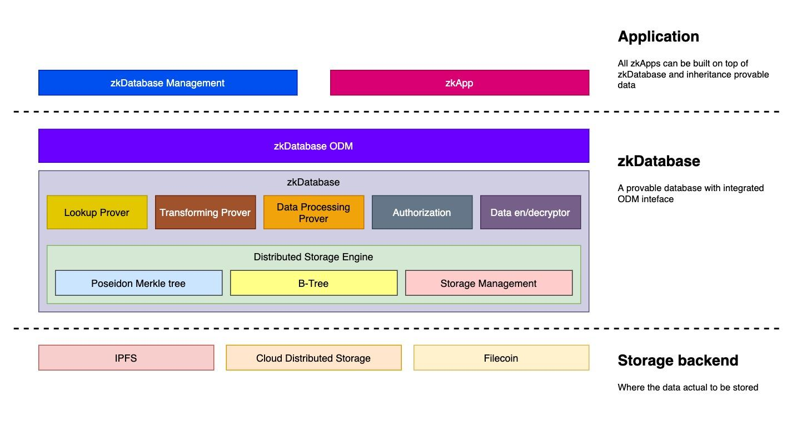

    

## Introduction

Data plays a critical role in any computational process, including the emerging Web3 era. In order to successfully transition to Web3, it is imperative to enhance accessibility and accuracy of data. The zkDatabase use a distributed storage engine that improves the availability of data. It utilizes Zero-Knowledge Proof to  ensuring the correctness of data in verifiable manner. With zkDatabase, it's allow developers to focus on developing their ideas, rather than managing the complexities of data storage and management.

**It's time for provable data.**

## Problem Statement

### Single point of failure

The current off-chain storage approach is plagued by a single point of failure issue, where data is not replicated, making it impossible to recover from faults.

_For instance, a centralized cloud storage provider experiences a downtime or data loss. This can result in a major loss of data for users who solely rely on this provider. Additionally, if the provider's backup and recovery systems are not robust enough, the data may be permanently lost. This can be a critical issue for businesses and organizations that store sensitive and important data._

### Accessibility

Achieving off-chain storage through ZKP and Merkle trees can ensure the immutability of the data, but it may limit accessibility to the public. Despite the data being public, not everyone can access it.

_For instance you have a public records need to everyone to audit but the data itself isn't available. Only merkle root was committed to public blockchain, we need to improve this by allowing the public data to be synced and accessible._

### Inconsistent data structure

Raw data needs to be structured and sorted to be useful. However, leaving this task to individual zkApps may result in inconsistent and unextendable data structures.

_To ensure consistency and extendability of the data structure, it is important to have a standardized approach to structuring and sorting the data. When every zkApp handles this individually, it can lead to fragmentation and inconsistency of the data structure, making it challenging to manage and extend the database over time._

### Lack of indexing

zkApps currently rely on key-value lookups and lack the ability to index structured data, which limits the potential of off-chain data storage and zkApps' capabilities.

_This limitation leads to inefficient data retrieval and reduces the overall efficiency of the application. Without proper indexing, zkApps struggle to manage large amounts of data, which can result in slow and inefficient data processing. Additionally, the lack of indexing makes it challenging to perform complex queries, limiting the types of analyses that can be performed on the data. As a result, there is a need for a more sophisticated storage system that can provide indexing capabilities to allow for more efficient data retrieval and analysis._

### Unextendibility

Managing a database involves not only ensuring its functionality but also evolving it to meet the changing demands of a business. There is no single tool that can entirely solve this issue.

_Maintaining a database is an ongoing process that requires constant attention as business needs change and evolve. However, there is no one-size-fits-all solution to evolving and adapting a database to meet changing demands, leading businesses to rely on a combination of tools and manual effort for effective management._

### The overhead in development

The overhead of managing off-chain and on-chain states slows down development and contributes to data fractionalization.

_Managing off-chain and on-chain states can be complex and time-consuming, leading to a slowdown in the development process and data fractionalization, where data is divided and spread across multiple locations, making it difficult to maintain consistency and accuracy._

### Inconvenient data management

Manual data management can be time-consuming and error-prone, making it difficult to identify and fix errors that could have significant consequences for a project or business.

_Manual data management is time-consuming, error-prone, and inefficient. The complexity of modern data systems and the need for precise organization and management make manual data management a challenging task, which may result in severe consequences for a project or business if errors go unnoticed._

## Solution

    

### Distributed storage engine

To prevent single point failure and ensure the availability of data, a distributed storage engine will be exploited. This engine will enable anyone with a replica of the data to reconstruct the database and its Merkle tree, ensuring that recovery from faults is possible.

_The distributed storage engine will provide redundancy and prevent data loss in the event of a single node failure. It also enables users to access and update data from any location, improving accessibility. Additionally, the use of Merkle trees allows for efficient verification of data integrity, ensuring that any alterations or inconsistencies can be easily identified and corrected. This feature enhances the security of the data, making it less susceptible to tampering or unauthorized access. Overall, the use of a distributed storage engine provides a reliable and secure way to manage and store data._

### Cryptographic authorization & encryption

Accessible to the public will be all public data while private data will be encrypted and only accessible through authorization.

_To ensure the security and privacy of private data, cryptographic authorization and encryption will be employed. This means that only authorized individuals will be able to access private data, and all communication and data exchange will be protected through encryption. Public data, on the other hand, will be freely accessible to anyone who needs it. This approach ensures that sensitive information is kept secure and only accessible to authorized parties, while still allowing for open access to non-sensitive information._

### BSON document

To maintain the consistency of the database, a predefined schema must be enforced using BSON documents to ensure that all data conforms to the same structure.

_The use of BSON documents to enforce a predefined schema ensures that all data adheres to the same structure, promoting consistency in the database. By establishing a set structure for the data, it becomes easier to manage and maintain the database. In addition, this approach can help prevent data inconsistencies and errors that can arise when data is not structured properly. BSON documents are a flexible and efficient way to enforce schema, making it easier to manage the database and ensure its accuracy and reliability over time._

### B-tree lookup

The use of B-tree indexing enables efficient data lookup, and its link to the Merkle tree must be established to validate the lookup process.

_By using B-tree indexing, data can be easily found and retrieved, making the database more efficient. However, it is important to check the integrity of the search process to ensure the accuracy and consistency of the retrieved data. To do this, you need to create a link between the B-tree and the Merkle tree. The Merkle tree provides a cryptographic proof of the integrity of the data, and the relationship between the B-tree and the Merkle tree provides a way to verify that the data retrieved from the B-tree is consistent with the data in the Merkle tree. This validation process helps prevent any potential errors or inconsistencies in the data._

### Proof of transformation

We enable users to update their document's schema by providing a proof of migration/ transformation.

_By providing proof of migration/transformation, users can easily update the schema of their documents. This feature provides greater flexibility in data management as users can make changes to their schema as needed to adapt to changing business needs._

**Note:** This process requires effort in R&D
 
### Standardization

The zkDatabase provides a standardized and developer-friendly library for creating, updating, and managing database, freeing up developers to focus on developing their ideas instead of wasting time managing state.

_The zkDatabase provides a standardized and user-friendly library that simplifies the process of creating, updating, and managing database. By providing a consistent and reliable approach, developers can reduce the time and effort required to manage states, allowing them to focus on developing their ideas and applications. This standardized library eliminates time-consuming and error-prone manual data management by providing consistent database management and maintenance for optimal performance._

### Graphical User Interface

Our graphical user interface simplifies the data management process by offering a visual representation of the data, allowing for more efficient manipulation, analysis, and collaboration while ensuring accuracy.

_The graphical user interface provided by zkDatabase offers an intuitive and user-friendly way to manage data. It allows users to easily navigate through the database and provides a visual representation of the data, making it easier to understand and manipulate. Overall, the GUI helps to streamline the data management process, saving time and improving productivity._

## Architecture

### Distributed Storage Engine

This module is the frontend of distributed storage, it provides a unified interface for multiple backends. This module solves the issue of the  single point  failure and also provides the flexibility to switch between distributed storage backend.

Fault tolerance is also the purpose of this module, recovery from error state is the feature that other off-chain storage is missing.

### Poseidon Merkle Tree

Poseidon Merkle Tree and ZKP are used to prove the immutability of zkDatabase, we follow the practice from zkApp Document for off-chain storage. Unlike other approaches, our Merkle tree is available publicly and it is also allowed to be reconstructed after fault.

### B-Tree

B-Tree is used to index the BSON document which speeds up the lookup process without the overhead.

**Note:** The field we use to index the BSON document needs to be unique and it's better to be stored in 31 bytes due to the infrastructure limit.

### Storage Management

This module is used to automate the process to store the data for the corresponding backend like IFPS, S3, FileCoin, etc. It also performs the indexing process and recomputes the Merkle tree whenever a new BSON document was inserted.

### Lookup Prover

This module creates a link between the Merkle tree and B-tree to prove the correctness of the lookup process. This module is necessary to prevent malicious action where the operator tries to feed the wrong BSON document.

### Transforming Prover

This is the most complex module, it proves the transformation and compatibility of database schemas. E.g: Reindexing is also a puzzle that affects the database schema.

### Data Processing

This module defines how we treat the data and how we have the conclusion of the data state. Every action like, insert, and update is required to be proven as well.

### Authorization

This module specifies the permission and the role of each user, we consider supporting DID and underlying MPC keyring to support permission grant and revoke.

**Note:** Need more R&D effort to clarify the need and choose the right solution.

### Data De/Encryption

This module guarantees that private data is secure and can't be accessible by an unwanted entity. Our first idea is to use AES encryption combine with Diffie Hellman key exchange to share the standard secret key.

**Note:** Need more R&D effort to allow a party to revoke a decrypt key.

### zkDatabase ODM

Instead of SQL, we build this project in a noSQL fashion, learnt from two successful projects MongoDB and Mongoose. In our conclusion, a language like SQL needs the parser and ORM to leverage its potential meanwhile ODM and non-related documents are better candidates with lower complexity. Besides, ODM and BSON documents are super effective when combine with TypeScript the main language for zkApp.

**Note:** A verifiable sampling module can turn zkDatabase into a passive zkOracle, it's the potential of the zkDatabase project that we want to explore in the future.

## Specification

We need your help to write the specification. The specification will be in a [different document](./specs/README.md).

## Contribute

This section will be updated soon but all contributions are welcomed, feeling free to create a [pull request](https://github.com/orochi-network/zkDatabase/pulls).

Please reach out to us on [zkDatabase @ Discord](https://discord.com/channels/1069494820386635796/1069500366145724476).

## Donation and Grants

Our financial report could be track here [zkDatabase financial report](https://docs.google.com/spreadsheets/d/14R24hdgQGp9RdkOmjAM_l3ZQiZXsbxXD06KjZ3a8Ct0/edit?usp=sharing)

## License

The source code of zkDatabase was licensed under [Apache-2.0](./LICENSE) that meant you are a co-owner of project, the ownership depends on the stake and effort that you put in this project.
