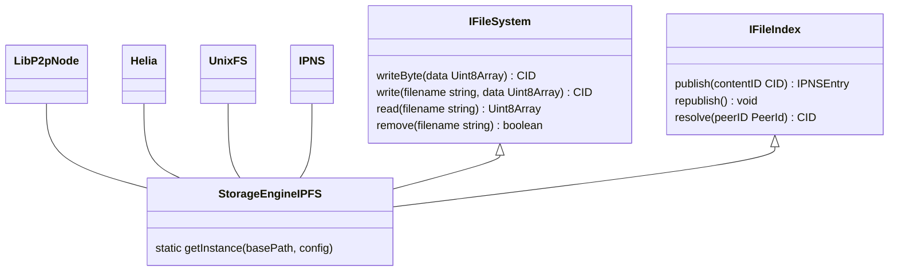

## Storage Engine

Storage Engine help us to handle file storage and local catching process, storage engine is also help to index files for further accession.

### IPFS Storage Engine

IPFS Storage Engine is a distributed storage engine based on [IPFS](https://ipfs.tech/). The `StorageEngineIPFS` ins an implementation of `IFileSystem` and `IFileIndex` that handle all I/O operations and indexing.

```ts
/**
 * An interface of file engine, depend on the environment
 * file engine could be different
 */
export interface IFileSystem<S, T, R> {
  writeBytes(_data: R): Promise<T>;
  write(_filename: S, _data: R): Promise<T>;
  read(_filename: S): Promise<R>;
  remove(_filename: S): Promise<boolean>;
}

/**
 * Method that performing index and lookup file
 */
export interface IFileIndex<S, T, R> {
  publish(_contentID: T): Promise<R>;
  republish(): void;
  resolve(_peerID?: S): Promise<T>;
}

/**
 * IPFS file system
 */

export type TIPFSFileSystem = IFileSystem<string, CID, Uint8Array>;

/**
 * IPFS file index
 */
export type TIPFSFileIndex = IFileIndex<PeerId, CID, IPNSEntry>;
```

The relationship between `StorageEngineIPFS` and other classes/interfaces is shown below:



In our implementation, we used `datastore-fs` and `blockstore-fs` to persist changes with local file, for now browser is lack of performance to handle connections and I/O. So the best possible solution is provide a local node that handle all I/O and connection.

#### Usage of IPFS Storage Engine

The database will be cached at local to make sure that the record are there event it's out live of liveness on IPFS network. To start an instance of `StorageEngineIPFS` we need to provide a `basePath` and `config` (we ignored config in this example):

```ts
const storageIPFS = await StorageEngineIPFS.getInstance(
  "/Users/chiro/GitHub/zkDatabase/zkdb/data"
);
```

The `basePath` is the path to the local cache folder, the folder will be created if it's not exist. The `config` is the configuration of IPFS node, we will use default config if it's not provided. After we get the instance of `StorageEngineIPFS` we could use it to perform I/O operations.

```ts
// Switch to collection `test`
newInstance.use("test");

// Write a document to current collection
await newInstance.writeBSON({ something: "stupid" });

// Read BSON data from ipfs
console.log(
  BSON.deserialize(
    await newInstance.read(
      "bbkscciq5an6kqbwixefbpnftvo34pi2jem3e3rjppf3hai2gyifa"
    )
  )
);
```

The process to update collection metadata and master metadata will be described in the following sections.

#### File mutability

Since a DAG nodes are immutable but we unable to update the `CID` every time. So `IPNS` was used, `IPNS` create a record that mapped a `CID` to a `PeerID` hence the `PeerID` is unchanged, so as long as we keep the `IPNSEntry` update other people could get the `CID` of the zkDatabase.

#### Metadata

The medata file is holding a mapping of data's poseidon hash to its `CID` that allowed us to retrieve the data from ipfs. It's also use to reconstruct the merkle tree. Metada is stored on IPFS and we also make a copy at local file system.

##### IPFS Storage Engine folder structure

The structure of data folder is shown below:

```text
├── helia
├── nodedata
│   ├── info
│   ├── peers
│   └── pkcs8
└── storage
    └── default
```

The `helia` folder is the folder that hold the Helia node's information, the `nodedata` folder is the folder that hold the IPFS node's information inclued node identity, peers and addition info. The `storage` folder is the folder that hold the data of our zkDatabase, all children folder of `storage` is the name of the collection, in this case we only have one collection called `default`.

#### Metadata structure

There is a `metadata` file at the root of `storage` folder that contains all the index records for children's metadata, we called it master metadata.

```json
{
  "default": "bafkreibbdesmz6d4fp2h24d6gebefzfl2i4fpxseiqe75xmt4fvwblfehu"
}
```

The `default` is the name of the collection and the `bafkreibbdesmz6d4fp2h24d6gebefzfl2i4fpxseiqe75xmt4fvwblfehu` is the `CID` of the collection's metadata file. We use the `IPNS` to point current node `PeerID` to the `CID` of the master metadata file by which we could retrieve the list of `CID` of the collection's metadata file.

There are also a `metadata` file at each collection folder, we called it collection metadata.

```json
{
  "bbkscciq5an6kqbwixefbpnftvo34pi2jem3e3rjppf3hai2gyifa": "bafkreifnz52i6ssyjqsbeogetwhgiabsjnztuuy6mshke5uemid33dsqny"
}
```

You might aware that the key of the collection metadata is the poseidon hash of the database document in `base32` encoding, and the value is the `CID` of the document. The collection metadata is used to retrieve the `CID` of the document by its poseidon hash. There is also a file in the collection folder with the name `bbkscciq5an6kqbwixefbpnftvo34pi2jem3e3rjppf3hai2gyifa.zkdb` contains the content of the document which was encoded by `BSON`.

#### BSON Document

BSON or Binnary JSON is a data structure that we used to encode and decode document. The document will be categorized into collections.
