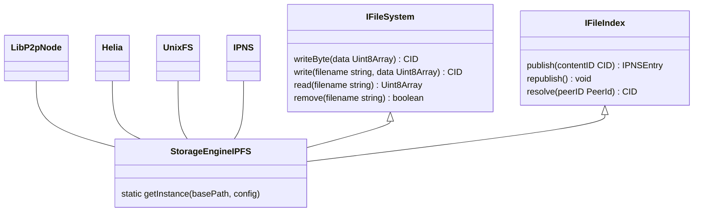

## Storage Engine

Storage Engine help us to handle file storage and local catching process, storage engine is also help to index files for further accession.

### IPFS Storage Engine

IPFS Storage Engine is a distributed storage engine based on [IPFS](https://ipfs.tech/). The `StorageEngineIPFS` ins an implementation of `IFileSystem` and `IFileIndex` that handle all I/O operations and indexing.

```ts
/**
 * An interface of file engine, depend on the environment
 * file engine could be different
 */
export interface IFileSystem<S, T, R> {
  writeBytes(_data: R): Promise<T>;
  write(_filename: S, _data: R): Promise<T>;
  read(_filename: S): Promise<R>;
  remove(_filename: S): Promise<boolean>;
}

/**
 * Method that performing index and lookup file
 */
export interface IFileIndex<S, T, R> {
  publish(_contentID: T): Promise<R>;
  republish(): void;
  resolve(_peerID?: S): Promise<T>;
}

/**
 * IPFS file system
 */

export type TIPFSFileSystem = IFileSystem<string, CID, Uint8Array>;

/**
 * IPFS file index
 */
export type TIPFSFileIndex = IFileIndex<PeerId, CID, IPNSEntry>;
```

The relationship between `StorageEngineIPFS` and other classes/interfaces is shown below:



In our implementation, we used `datastore-fs` and `blockstore-fs` to persist changes with local file, for now browser is lack of performance to handle connections and I/O. So the best possible solution is provide a local node that handle all I/O and connection.

#### File mutability

Since a DAG nodes are immutable but we unable to update the `CID` every time. So `IPNS` was used, `IPNS` create a record that mapped a `CID` to a `PeerID` hence the `PeerID` is unchanged, so as long as we keep the `IPNSEntry` update other people could get the `CID` of the zkDatabase.

#### Metadata

The medata file is holding a mapping of data's poseidon hash to its `CID` that allowed us to retrieve the data from ipfs. It's also use to reconstruct the merkle tree.

#### BSON Document

BSON or Binnary JSON is a data structure that we used to encode and decode document. The document will be categorized into collections.
